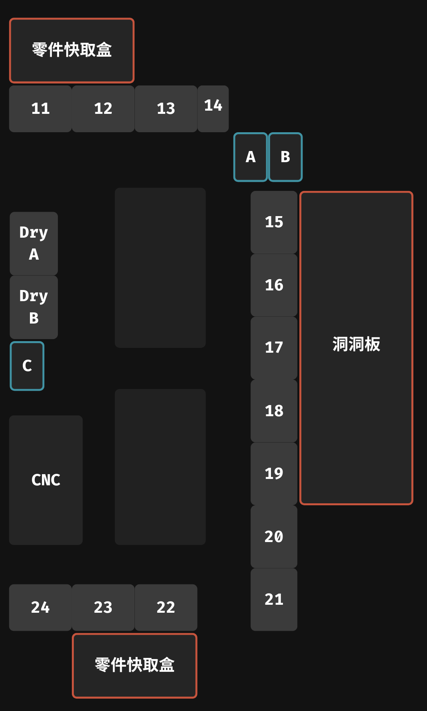

# 培訓室工具與材料管理系統

請建立一個可直接執行與部署的**純靜態網頁應用程式**，用來管理培訓室內工具、設備與材料的存放位置、狀態及數量。

請根據我附上的：

1. 培訓室平面圖
2. 網頁排版參考圖片
3. 以下功能規格與配色

完成整體 UI、頁面架構、資料模型與主要互動功能。

---

## 一、指定技術

本專案只能使用：

* HTML5
* CSS3
* 原生 JavaScript（Vanilla JavaScript）
* Firebase Web SDK
* JSON 設定檔

請不要使用：

* React
* Vue
* Angular
* Svelte
* TypeScript
* Tailwind CSS
* Bootstrap
* Node.js 後端
* Express
* 任何需要編譯、打包或建置才能執行的框架

網頁必須能直接透過靜態網站服務部署，例如：

* GitHub Pages
* Cloudflare Pages
* Firebase Hosting
* Netlify
* 一般靜態網頁伺服器

開發時可以使用 ES Modules，但必須確保部署後瀏覽器可以直接載入。

---

## 二、專案目標

此應用程式應讓培訓室成員能夠：

* 從培訓室平面圖查看各個櫃子、工具車及材料區的位置
* 點擊平面圖上的區域，查看該位置存放的工具與材料
* 新增、編輯或刪除工具及材料
* 設定工具目前的使用狀態
* 記錄材料的大約剩餘數量
* 使用名稱、標籤或其他關鍵字搜尋物品
* 快速得知搜尋結果位於哪一個櫃子、抽屜或層板
* 透過 JSON 修改培訓室內櫃子的位置與物理結構
* 將實際工具與材料資料儲存在 Firebase Firestore

---

# 三、網站頁面架構

請建立多頁式或以 JavaScript 動態切換內容的靜態網站。

建議頁面：

```text
index.html
storage.html
```

其中：

* `index.html`：培訓室平面圖與全域搜尋
* `storage.html?id=cabinet-a`：顯示指定櫃子的詳細內容

也可以採用單頁式設計，但必須使用 URL 查詢參數或 Hash Router，讓每個櫃子具有可直接開啟的網址。

例如：

```text
storage.html?id=cabinet-a
storage.html?id=tool-cart-1
```

請不要為每一個櫃子建立一份獨立 HTML。

所有櫃子的詳細頁面應共用同一套 HTML 與 JavaScript，並依照網址參數載入不同資料。

---

# 四、建議專案結構

請建立清楚、容易維護的專案結構：

```text
workshop-manager/
├── index.html
├── storage.html
├── css/
│   ├── theme.css
│   ├── layout.css
│   ├── components.css
│   ├── home.css
│   └── storage.css
├── js/
│   ├── app.js
│   ├── home.js
│   ├── storage.js
│   ├── firebase-config.js
│   ├── firebase-service.js
│   ├── data-service.js
│   ├── search.js
│   ├── map-renderer.js
│   ├── storage-renderer.js
│   ├── item-form.js
│   ├── modal.js
│   ├── notifications.js
│   └── utils.js
├── config/
│   ├── workshop-map.json
│   └── storage-structures.json
├── data/
│   └── demo-items.json
├── images/
│   ├── workshop-floor-plan.png
│   └── placeholder-item.png
└── README.md
```

請避免將所有程式碼集中在單一巨大 HTML 或 JavaScript 檔案中。

---

# 五、Firebase 設定

請使用 Firebase Web SDK，並預留 Firebase 設定檔。

例如：

```js
// js/firebase-config.js

export const firebaseConfig = {
  apiKey: "YOUR_API_KEY",
  authDomain: "YOUR_AUTH_DOMAIN",
  projectId: "YOUR_PROJECT_ID",
  storageBucket: "YOUR_STORAGE_BUCKET",
  messagingSenderId: "YOUR_MESSAGING_SENDER_ID",
  appId: "YOUR_APP_ID",
  measurementId: "YOUR_MEASUREMENT_ID"
};
```

我之後會自行填入：

* `apiKey`
* `authDomain`
* `projectId`
* `storageBucket`
* `messagingSenderId`
* `appId`
* `measurementId`

請將 Firebase 初始化及 Firestore 操作集中在獨立 JavaScript 檔案中。

例如：

```text
js/firebase-config.js
js/firebase-service.js
```

可以透過 Firebase CDN 載入 Firebase Web SDK，例如：

```js
import { initializeApp } from
  "https://www.gstatic.com/firebasejs/版本號/firebase-app.js";

import {
  getFirestore,
  collection,
  getDocs,
  addDoc,
  updateDoc,
  deleteDoc,
  doc
} from "https://www.gstatic.com/firebasejs/版本號/firebase-firestore.js";
```

請使用穩定版本，並確保所有 Firebase 模組使用相同版本。

---

## 六、Firebase 未設定時的行為

當 Firebase 設定尚未填入時：

* 網頁不可崩潰
* 不可出現空白頁
* 自動改用 `data/demo-items.json`
* 所有介面仍可正常預覽
* 新增、修改與刪除操作可先在瀏覽器記憶體或 `localStorage` 中運作
* 顯示「目前使用示範資料」提示

請建立資料存取抽象層。

例如：

```js
async function getItems() {}
async function createItem(item) {}
async function updateItem(id, updates) {}
async function deleteItem(id) {}
```

資料層應自動判斷目前使用：

* Firebase Firestore
* 本機示範資料
* localStorage

其他頁面不應直接操作 Firestore。

---

# 七、培訓室總覽首頁

首頁是整個系統的主要入口。

頁面應包含：

* 頂部導覽列
* 網站名稱或 Logo
* 全域搜尋欄
* 培訓室平面圖
* 可點擊的櫃子區域
* 工具與材料狀態摘要
* 搜尋結果面板
* 狀態圖例
* Firebase 或示範資料狀態

請將我附上的培訓室平面圖放在首頁主要區域。

建議 HTML 結構：

```html
<main class="home-layout">
  <aside class="sidebar">
    <!-- 搜尋與篩選 -->
  </aside>

  <section class="map-panel">
    <!-- 平面圖 -->
  </section>

  <aside class="summary-panel">
    <!-- 狀態摘要或搜尋結果 -->
  </aside>
</main>
```

---

# 八、平面圖顯示方式

培訓室平面圖必須：

* 維持原始比例
* 自動配合容器縮放
* 不被拉伸變形
* 能在桌面與平板正常操作
* 小螢幕可縮放或水平捲動
* 平面圖上的可點擊區域必須同步縮放

建議結構：

```html
<div class="workshop-map-wrapper">
  <div class="workshop-map">
    

    <div id="map-hotspots"></div>
  </div>
</div>
```

其中 `workshop-map` 使用：

```css
.workshop-map {
  position: relative;
  display: inline-block;
}

.workshop-map img {
  display: block;
  width: 100%;
  height: auto;
}

.map-hotspot {
  position: absolute;
}
```

---

# 九、平面圖區域 JSON

平面圖上所有櫃子與儲存區的位置，必須從 JSON 載入。

請不要將座標直接寫死在 HTML 或 JavaScript 中。

使用百分比座標，以確保平面圖縮放後仍能正確對應。

`config/workshop-map.json` 範例：

```json
{
  "mapImage": "images/workshop-floor-plan.png",
  "areas": [
    {
      "id": "cabinet-a",
      "name": "工具櫃 A",
      "type": "cabinet",
      "x": 12.5,
      "y": 18,
      "width": 16,
      "height": 24,
      "rotation": 0,
      "structureId": "cabinet-a-structure"
    },
    {
      "id": "tool-cart-1",
      "name": "工具車 1",
      "type": "tool-cart",
      "x": 52,
      "y": 42,
      "width": 12,
      "height": 18,
      "rotation": 0,
      "structureId": "tool-cart-1-structure"
    }
  ]
}
```

欄位說明：

* `id`：櫃子或區域的唯一 ID
* `name`：顯示名稱
* `type`：櫃子類型
* `x`：左上角水平位置百分比
* `y`：左上角垂直位置百分比
* `width`：寬度百分比
* `height`：高度百分比
* `rotation`：旋轉角度
* `structureId`：對應的櫃子結構 ID

JavaScript 載入 JSON 後，動態建立區域：

```js
const hotspot = document.createElement("button");

hotspot.className = "map-hotspot";
hotspot.style.left = `${area.x}%`;
hotspot.style.top = `${area.y}%`;
hotspot.style.width = `${area.width}%`;
hotspot.style.height = `${area.height}%`;
hotspot.style.transform = `rotate(${area.rotation || 0}deg)`;
```

---

# 十、平面圖區域互動

每個區域必須可以：

* 滑鼠移入時高亮
* 鍵盤 Tab 選取
* 按 Enter 或 Space 開啟
* 點擊後進入櫃子詳細頁面
* 顯示 Tooltip
* 搜尋結果對應時閃爍或高亮

Tooltip 顯示：

* 櫃子名稱
* 櫃子類型
* 物品總數
* 可用工具數量
* 使用中工具數量
* 低存量材料數量

點擊後導向：

```js
window.location.href =
  `storage.html?id=${encodeURIComponent(area.id)}`;
```

---

# 十一、櫃子詳細頁面

詳細頁面依照網址中的 `id` 載入櫃子資料。

例如：

```js
const params = new URLSearchParams(window.location.search);
const storageId = params.get("id");
```

詳細頁面顯示：

* 櫃子名稱
* 櫃子類型
* 櫃子說明
* 返回平面圖按鈕
* 櫃子的物理結構
* 各抽屜、層板或格子的物品
* 新增物品按鈕
* 編輯物品功能
* 刪除物品功能
* 搜尋與篩選
* 工具與材料統計

若網址中的櫃子不存在，顯示清楚的錯誤頁面，不可直接崩潰。

---

# 十二、櫃子物理結構 JSON

櫃子的物理結構只能由 JSON 設定檔定義。

此 JSON 只負責描述：

* 櫃子有幾列
* 櫃子有幾欄
* 抽屜或層板位置
* 每一格名稱
* 每一格大小
* 是否跨欄
* 是否跨列
* 格子類型

它不應儲存實際工具與材料資料。

`config/storage-structures.json` 範例：

```json
{
  "structures": [
    {
      "id": "cabinet-a-structure",
      "name": "工具櫃 A",
      "layoutType": "grid",
      "columns": 3,
      "rows": 4,
      "sections": [
        {
          "id": "drawer-a1",
          "name": "A1 抽屜",
          "row": 1,
          "column": 1,
          "rowSpan": 1,
          "columnSpan": 1,
          "type": "drawer"
        },
        {
          "id": "drawer-a2",
          "name": "A2 抽屜",
          "row": 1,
          "column": 2,
          "rowSpan": 1,
          "columnSpan": 2,
          "type": "drawer"
        },
        {
          "id": "shelf-a3",
          "name": "A3 層板",
          "row": 2,
          "column": 1,
          "rowSpan": 2,
          "columnSpan": 3,
          "type": "shelf"
        }
      ]
    }
  ]
}
```

JavaScript 應依據 JSON 動態產生 CSS Grid。

例如：

```js
grid.style.gridTemplateColumns =
  `repeat(${structure.columns}, minmax(0, 1fr))`;

grid.style.gridTemplateRows =
  `repeat(${structure.rows}, minmax(100px, auto))`;
```

每個 section：

```js
sectionElement.style.gridColumn =
  `${section.column} / span ${section.columnSpan || 1}`;

sectionElement.style.gridRow =
  `${section.row} / span ${section.rowSpan || 1}`;
```

請不要針對不同櫃子撰寫不同的硬編碼 HTML。

---

# 十三、工具與材料資料模型

實際物品資料儲存在 Firestore。

建議使用統一的 `items` collection，透過 `category` 區分工具與材料。

工具範例：

```json
{
  "id": "item-001",
  "name": "電動起子",
  "category": "tool",
  "storageId": "cabinet-a",
  "sectionId": "drawer-a1",
  "status": "available",
  "quantity": null,
  "unit": null,
  "tags": [
    "電動工具",
    "螺絲",
    "常用"
  ],
  "description": "12V 充電式電動起子",
  "imageUrl": "",
  "updatedAt": "SERVER_TIMESTAMP"
}
```

材料範例：

```json
{
  "id": "item-002",
  "name": "M4 螺絲",
  "category": "material",
  "storageId": "cabinet-a",
  "sectionId": "drawer-a2",
  "status": "available",
  "quantity": 120,
  "quantityMode": "approximate",
  "unit": "顆",
  "minimumQuantity": 30,
  "tags": [
    "螺絲",
    "M4",
    "五金"
  ],
  "description": "M4 × 20 mm",
  "imageUrl": "",
  "updatedAt": "SERVER_TIMESTAMP"
}
```

---

# 十四、工具狀態

工具至少支援：

```text
available
in-use
maintenance
missing
unavailable
```

中文顯示：

* `available`：可用
* `in-use`：使用中
* `maintenance`：維修中
* `missing`：找不到
* `unavailable`：不可用

狀態顏色：

* 可用：Success
* 使用中：Warning
* 維修中：Info
* 找不到：Danger
* 不可用：Danger

工具狀態必須能從編輯表單修改。

---

# 十五、材料數量

材料支援：

* 大約數量
* 計量單位
* 最低存量
* 低存量警示
* 無存量狀態

單位範例：

* 個
* 顆
* 支
* 片
* 公尺
* 公斤
* 包
* 盒
* 捲
* 瓶

當：

```js
item.quantity <= item.minimumQuantity
```

時，顯示低存量警告。

若數量為 `0`，顯示缺貨狀態。

材料數量是近似值，不需要設計成精密會計庫存系統。

---

# 十六、新增與編輯物品

請建立可重複使用的新增與編輯 Modal。

表單欄位至少包含：

* 名稱
* 類型：工具或材料
* 所屬櫃子
* 所屬抽屜、層板或格子
* 工具狀態
* 材料數量
* 數量模式
* 單位
* 最低存量
* 標籤
* 說明
* 圖片網址

表單應根據類型動態顯示欄位：

選擇工具時：

* 顯示工具狀態
* 隱藏材料數量欄位

選擇材料時：

* 顯示數量
* 顯示單位
* 顯示最低存量
* 隱藏不適用的工具狀態

表單需要：

* 必填欄位驗證
* 錯誤訊息
* 取消按鈕
* 儲存按鈕
* 編輯時自動填入舊資料
* 儲存中狀態
* 成功或失敗通知

---

# 十七、刪除功能

刪除前必須顯示確認視窗。

確認視窗顯示：

* 即將刪除的物品名稱
* 物品所在位置
* 此操作無法復原的提示
* 取消按鈕
* 確認刪除按鈕

刪除按鈕使用 Danger 配色。

不可使用未確認即直接刪除的行為。

---

# 十八、搜尋功能

首頁必須有明顯的搜尋欄。

搜尋範圍：

* 工具名稱
* 材料名稱
* 標籤
* 說明
* 櫃子名稱
* 抽屜或層板名稱

搜尋規則：

* 不區分英文大小寫
* 去除輸入前後空白
* 支援部分關鍵字
* 支援中文
* 可即時顯示結果
* 搜尋無結果時顯示空白狀態

搜尋結果顯示：

* 物品名稱
* 工具或材料類型
* 工具狀態或材料數量
* 完整位置
* 標籤
* 開啟位置按鈕

位置格式：

```text
工具櫃 A → A2 抽屜
```

點擊搜尋結果後：

1. 導向對應櫃子詳細頁面
2. 將對應抽屜或層板高亮
3. 將對應物品高亮
4. 自動捲動至該位置

可以透過網址參數傳送高亮目標：

```text
storage.html?id=cabinet-a&section=drawer-a2&item=item-002
```

---

# 十九、標籤系統

每個物品可以有多個標籤。

標籤支援：

* 新增
* 刪除
* 搜尋
* 點擊篩選
* 使用 Badge 或 Chip 顯示

標籤範例：

```text
常用
電動工具
手工具
電子零件
五金
耗材
FRC
木工
金工
安全設備
```

表單中可以讓使用者：

* 輸入文字
* 按 Enter 建立標籤
* 點擊 × 移除標籤
* 防止重複標籤

---

# 二十、指定配色

請將以下 CSS 變數放在 `css/theme.css`：

```css
:root {
  /** Base text colors */
  --cffy-theme-light-a0: #ffffff;
  --cffy-theme-dark-a0: #000000;

  /** Theme primary colors */
  --cffy-theme-primary-a0: #c6543d;
  --cffy-theme-primary-a10: #ce6651;
  --cffy-theme-primary-a20: #d57864;
  --cffy-theme-primary-a30: #dc8977;
  --cffy-theme-primary-a40: #e29a8a;
  --cffy-theme-primary-a50: #e8ab9d;

  /** Theme surface colors */
  --cffy-theme-surface-a0: #121212;
  --cffy-theme-surface-a10: #252525;
  --cffy-theme-surface-a20: #393939;
  --cffy-theme-surface-a30: #4f4f4f;
  --cffy-theme-surface-a40: #666666;
  --cffy-theme-surface-a50: #7d7d7d;

  /** Success colors */
  --cffy-theme-success-a0: #7dff95;
  --cffy-theme-success-a10: #9dffac;
  --cffy-theme-success-a20: #b8ffc1;

  /** Warning colors */
  --cffy-theme-warning-a0: #ffbc5e;
  --cffy-theme-warning-a10: #ffca83;
  --cffy-theme-warning-a20: #ffd8a4;

  /** Danger colors */
  --cffy-theme-danger-a0: #ff8080;
  --cffy-theme-danger-a10: #ff9b99;
  --cffy-theme-danger-a20: #ffb5b2;

  /** Info colors */
  --cffy-theme-info-a0: #87d1ff;
  --cffy-theme-info-a10: #a1dbff;
  --cffy-theme-info-a20: #b9e4ff;
}
```

使用方式：

* 頁面背景：`--cffy-theme-surface-a0`
* 導覽列：`--cffy-theme-surface-a10`
* 卡片背景：`--cffy-theme-surface-a20`
* 邊框：`--cffy-theme-surface-a30`
* 主要文字：`--cffy-theme-light-a0`
* 次要文字：`--cffy-theme-surface-a50`
* 主要按鈕：`--cffy-theme-primary-a0`
* 主要按鈕 Hover：`--cffy-theme-primary-a10`
* 成功狀態：Success
* 警告狀態：Warning
* 危險狀態：Danger
* 一般資訊：Info

---

# 二十一、UI 風格

整體風格：

* 深色主題
* 現代培訓室管理面板
* 清楚的資訊層級
* 適合桌面及平板操作
* 卡片式介面
* 圓角適中
* 使用細邊框區分區域
* 避免過度漸層
* 避免過度動畫
* 保持良好對比
* 介面不可過度擁擠
* 也不可留下過多無意義空白

請參考我附上的排版設計圖片，但不要只做圖片的直接複製。

應將參考圖片的：

* 留白比例
* 面板配置
* 字體層級
* 卡片設計
* 導覽方式

整合進此培訓室管理系統。

---

# 二十二、響應式設計

桌面版建議：

```text
左側：搜尋及篩選
中央：培訓室平面圖
右側：摘要或搜尋結果
```

平板版：

* 左右面板可收合
* 平面圖保持主要顯示區域
* 搜尋結果可改為側邊 Drawer

手機版：

* 改為單欄
* 平面圖可以縮放或水平捲動
* 搜尋結果顯示於平面圖下方
* Modal 幾乎佔滿畫面
* 表單改為單欄
* 按鈕需有足夠的觸控大小

建議至少支援：

```css
@media (max-width: 1200px) {}

@media (max-width: 768px) {}

@media (max-width: 480px) {}
```

---

# 二十三、無障礙與鍵盤操作

請加入基本無障礙支援：

* 所有按鈕使用 `<button>`
* 所有表單欄位有 `<label>`
* 圖片有 `alt`
* Modal 使用適當的 ARIA 屬性
* 可使用 Tab 移動焦點
* 可使用 Escape 關閉 Modal
* 可點擊平面圖區域必須可用鍵盤開啟
* Focus 狀態必須清楚
* 不可只依賴顏色傳達狀態

---

# 二十四、提示與通知

請建立統一的通知元件，用來顯示：

* 新增成功
* 修改成功
* 刪除成功
* Firebase 連線失敗
* 資料載入失敗
* 表單錯誤
* 目前使用示範資料

通知形式可使用 Toast。

Toast 需要：

* 自動消失
* 可手動關閉
* Success、Warning、Danger、Info 樣式
* 不遮住主要操作按鈕

---

# 二十五、載入與空白狀態

請處理：

* 資料正在載入
* 櫃子沒有物品
* 搜尋沒有結果
* Firebase 尚未設定
* Firebase 連線失敗
* JSON 載入失敗
* 找不到櫃子
* 找不到櫃子結構
* 圖片載入失敗
* 物品資料缺少部分欄位

請使用清楚的介面訊息，不要只在 Console 顯示錯誤。

---

# 二十六、Firebase 資料操作

請在 `firebase-service.js` 或 `data-service.js` 中提供以下函式：

```js
export async function getItems() {}

export async function getItemsByStorageId(storageId) {}

export async function getItemById(itemId) {}

export async function createItem(itemData) {}

export async function updateItem(itemId, updates) {}

export async function deleteItem(itemId) {}

export async function searchItems(query) {}
```

Firestore collection 建議：

```text
items
```

每筆文件代表一個工具或材料。

建立資料時應加入：

```js
createdAt
updatedAt
```

更新資料時修改：

```js
updatedAt
```

搜尋可先載入資料後在前端執行，不需要強行使用 Firestore 做多欄位模糊搜尋。

---

# 二十七、搜尋邏輯範例

請將搜尋邏輯獨立放在 `js/search.js`。

搜尋前先標準化文字：

```js
function normalizeText(value) {
  return String(value || "")
    .trim()
    .toLowerCase();
}
```

比對內容至少包含：

```js
[
  item.name,
  item.description,
  ...(item.tags || []),
  storageName,
  sectionName
]
```

搜尋功能不可只比對名稱。

---

# 二十八、示範資料

請建立足夠的示範資料，讓網頁開啟後即可展示完整功能。

至少包含：

* 3 個工具櫃
* 1 台工具車
* 8 種工具
* 8 種材料
* 不同工具狀態
* 不同材料數量
* 至少 2 個低存量材料
* 每個櫃子有不同結構
* 多組搜尋標籤
* 至少一個沒有物品的抽屜
* 至少一個維修中的工具
* 至少一個使用中的工具

---

# 二十九、localStorage 示範模式

Firebase 尚未設定時，請使用 localStorage 保存使用者修改。

建議 Key：

```text
workshop-manager-items
```

初次開啟時：

1. 載入 `data/demo-items.json`
2. 寫入 localStorage
3. 後續新增、修改、刪除都寫回 localStorage

請提供重設示範資料功能。

例如：

```text
設定或工具選單 → 重設示範資料
```

重設前需顯示確認視窗。

---

# 三十、資料安全

請注意：

* Firebase API Key 可以放在前端，但不可視為權限保護措施
* README 必須提醒使用者設定 Firestore Security Rules
* 不可將 Firestore 設為永久公開讀寫
* 不可在程式碼中放入 Firebase 管理員金鑰
* 不可使用 Firebase Admin SDK
* 不可將 Service Account JSON 放在前端專案

目前可以先不做登入，但程式架構應保留未來加入 Firebase Authentication 的空間。

---

# 三十一、可擴充功能

目前不必完整實作，但架構應方便未來加入：

* 使用者登入
* 管理員權限
* 借用人
* 借出與歸還紀錄
* QR Code
* 條碼掃描
* 圖片上傳
* 操作紀錄
* 材料採購清單
* 多個培訓室
* 即時同步
* 修改平面圖區域的圖形化編輯器

---

# 三十二、實作限制

請遵守：

1. 只能使用 HTML、CSS、原生 JavaScript。
2. 不可使用 React、Vue、TypeScript 或其他框架。
3. 不可要求使用者執行 npm build。
4. 不可建立 Node.js 後端。
5. 不可把物品資料寫入櫃子結構 JSON。
6. JSON 只負責平面圖位置與櫃子物理結構。
7. 工具與材料資料應存放 Firestore 或 localStorage。
8. 不可為每個櫃子建立不同 HTML。
9. 不可把所有功能寫在單一巨大 JavaScript 檔案。
10. 不可省略新增、修改、刪除及搜尋功能。
11. 所有主要按鈕都必須能實際操作。
12. 不可只建立靜態 UI 示意圖。
13. 不可忽略附上的平面圖。
14. 不可忽略附上的排版參考圖片。
15. Firebase 未設定時不可崩潰。

---

# 三十三、完成標準

完成後，使用者應能夠：

* 在首頁看到培訓室平面圖
* 在平面圖上看到可點擊的櫃子區域
* Hover 時查看櫃子摘要
* 點擊櫃子進入詳細頁面
* 根據 JSON 顯示櫃子不同抽屜與層板
* 查看每一格中的工具與材料
* 新增工具或材料
* 編輯工具或材料
* 修改工具狀態
* 修改材料數量
* 修改標籤與說明
* 刪除物品
* 搜尋名稱、說明或標籤
* 查看搜尋結果完整位置
* 從搜尋結果跳到正確櫃子
* 自動高亮正確抽屜及物品
* Firebase 尚未設定時使用示範資料
* Firebase 設定完成後使用 Firestore
* 重新整理後保留示範模式的修改

---

# 三十四、README 要求

請提供完整但簡潔的 `README.md`，說明：

* 專案功能
* 專案檔案結構
* 如何在本機執行
* 為何不能直接用 `file://` 開啟 JSON
* 如何使用簡易 HTTP Server
* 如何部署至 GitHub Pages
* 如何部署至 Cloudflare Pages
* 如何替換培訓室平面圖
* 如何修改櫃子座標
* 如何新增櫃子
* 如何修改櫃子物理結構
* 如何填入 Firebase 設定
* Firestore collection 結構
* Firestore Security Rules 注意事項
* 如何重設示範資料

本機執行方式可以說明：

```bash
python -m http.server 8000
```

之後開啟：

```text
http://localhost:8000
```

但實際網站本身不可依賴 Python。

---

# 三十五、輸出要求

請直接產生完整且可執行的專案檔案，不要只提供設計說明或虛擬程式碼。

輸出時請確保：

* HTML 結構完整
* CSS 可正常載入
* JavaScript import 路徑正確
* JSON 格式正確
* Firebase SDK 載入方式正確
* 頁面沒有明顯 Console Error
* 所有主要按鈕具有功能
* Firebase 未設定時可以使用 localStorage
* 平面圖區域由 JSON 動態建立
* 櫃子結構由 JSON 動態建立
* 搜尋可以正常使用
* 新增、編輯與刪除可以正常使用
* README 包含完整操作說明

請優先完成：

1. 正確的資料架構
2. 可操作的主要功能
3. 平面圖互動
4. 搜尋與定位
5. Firebase 與示範資料切換
6. 響應式介面
7. 視覺細節與動畫

不要只生成單一 `index.html` 並把所有 CSS 和 JavaScript 全部塞在其中。請輸出結構清楚、可維護的多檔案專案。
